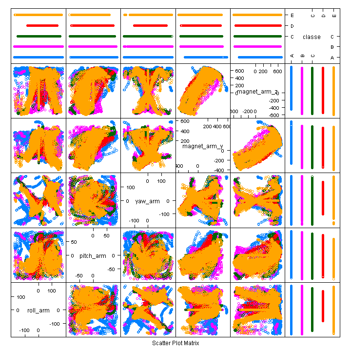
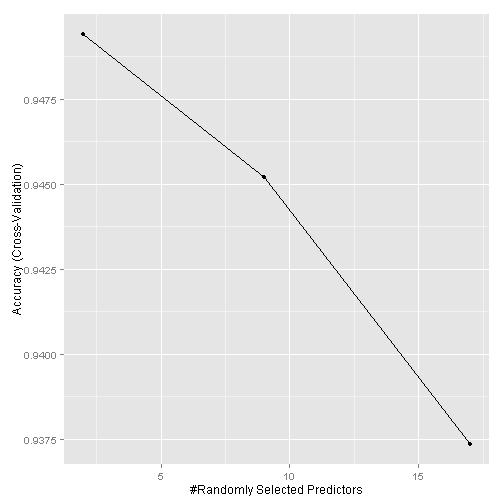
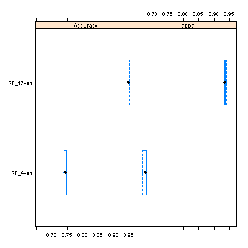

## Abstract
A supervised Predictive Machine Learning (PML) model evaluates execution for the human activity of weight lifting--dumbell curls.  The method generating the supervised PML model is [Random Forest](https://www.stat.berkeley.edu/~breiman/RandomForests/cc_manual.htm) (rf).  Two rf models are generated and compared with respect to accuracy and Kappa.  In one model, predictors are selected based on qualitative review of exploratory plots.  In the second model, predictors are selected using best known methods, e.g. removing predictors with near-zero variance.

## Introduction
Given a specification for a human activity (HA), a supervised PML model can assess quality of execution for the HA.  For more information, see the [website](http://groupware.les.inf.puc-rio.br/har#ixzz3ge9XCk9l) of Ugulino et. al.[1].

Methodology of this work is predicated on Reproducible Research (RR).  That is, a reader can reproduce this work within a R-programming framework by downloading and executing this document [index.Rmd](https://github.com/bamcdougall/Predictive_Machine_Learning_Human_Activity_Assessment/blob/master/index.Rmd).

Since this work focuses on developing a rf PML model that classifies quality of an executed HA, only a brief introduction is provided for the physical experiment.  Six male participants with age 20-28 years perform one set of 10 repetitions of the Unilateral Dumbbell Biceps Curl in five distinct modes:

* exactly per expert specification (Class A), 
* throwing the elbows to the front (Class B),
* lifting the dumbbell only halfway (Class C),
* lowering the dumbbell only halfway (Class D),
* and throwing the hips to the front (Class E).

Class A defines the specification. Classes B-E are errors.

Based on the two models generated in this RR, accuracy and kappa are 95% and 94%, respectively, based on five-fold cross-validation.  The out of sample error rate is not less than 5%.

## Experimental Methods
Discussion of experimental methods is mostly confined to data analyses.  For detailed collection of physical data, see the original work by Ugulino et. al.[1].  Information sufficient for understanding the dataframe is provided.

Data are collected using four inertial measurement units (IMU), which provide three-axes acceleration, gyroscope and magnetometer data at a joint sampling rate of 45 Hz.  Derived features for each Euler angle from each sensor include: mean, variance, standard deviation, max, min, amplitude, kurtosis and skewness.  The authors select seventeen features for modeling.

The eighteen features used for PML development by the original authors are:

* belt sensor: mean and variance of  roll
* belt sensor:  maximum, range, and variance of accelerometer vector
* belt sensor:  variance of gyro and variance of magnetometer 7 
* arm sensor:  variance of accelerometer vector
* arm sensor:  maximum and minimum of magnetometer 4
* dumbell sensor:  maximum of acceleration
* dumbell sensor:  variance of gyro
* dumbell sensor:  maximum and minimum of magnetometer 4
* glove sensor:  sum of the pitch and the maximum and minimum of gyro 3

This work trains a supervised PML model using two different groups of predictors that are independent of work by the original authors.  The [CodeBook](https://github.com/bamcdougall/Predictive_Machine_Learning_Human_Activity_Assessment/blob/master/CodeBook.md) provides a listing of variables from the Global Environment for this project.

### Prepare R-environment
The R-environment is prepared and documented:

```r
library(plyr); library(dplyr) # order dependent
library(caret); library(ElemStatLearn); library(AppliedPredictiveModeling)
library(pgmm); library(rpart); library(partykit); library(rpart.plot); 
library(rattle); library(doParallel); library(C50)
library(ipred); library(pROC); library(ada); library(gbm);library(mboost);
library(forecast); library(e1071); library(stringi); library(ElemStatLearn)
library(xtable); library(knitr); library(Cairo)

setwd("E:\\Brendan\\Documents\\Education\\JohnsHopkins_Crsera\\08_MachineLearning\\Project\\Submitted")
curDir <- getwd()
fileList <- dir()
environment <- sessionInfo()
write(fileList, file = 'fileList.txt')
writeLines(unlist(lapply(environment, paste, collapse=" ")),
           con = 'environment.txt', sep = "\n", useBytes = FALSE)
```
Libraries are loaded beyond the minimum requirement that provide exploratory flexibility.

### Load Data
Data are loaded after a priori review of the *Testing* dataframe.  Columns of NAs are discarded from the *Testing* dataframe. Similarly, the corresponding columns are discarded from the Training dataframe.  Without discarding columns, the training dataframe is [19,622 obs. of 160 variables], and the testing dataframe is [20 obs. of 160 variables].

```r
urlTraining <- "https://d396qusza40orc.cloudfront.net/predmachlearn/pml-training.csv"
urlTesting <- "https://d396qusza40orc.cloudfront.net/predmachlearn/pml-testing.csv"

trainingFile <- "./pml-training.csv"
testingFile <- "./pml-testing.csv"

if( !file.exists(trainingFile) ) download.file(urlTraining, mode="w", trainingFile, method="curl")
if( !file.exists(trainingFile) ) download.file(urlTesting, mode="w", testingFile, method="curl")

# Caution:  there distinct text entries that need identification for na.strings
pmlTrainingTrim <- tbl_df(
    read.csv2('pml-training.csv', sep = ",", stringsAsFactors = FALSE, na.strings = "NA",
              header = TRUE)
    )  %>%
    select(
        roll_belt, pitch_belt, yaw_belt, total_accel_belt, gyros_belt_x, gyros_belt_y, 
        gyros_belt_z, accel_belt_x, accel_belt_y, accel_belt_z,    magnet_belt_x, 
        magnet_belt_y, magnet_belt_z, roll_arm, pitch_arm, yaw_arm,    total_accel_arm,
        gyros_arm_x, gyros_arm_y, gyros_arm_z, accel_arm_x, accel_arm_y, accel_arm_z, 
        magnet_arm_x, magnet_arm_y, magnet_arm_z,
        roll_dumbbell, pitch_dumbbell, yaw_dumbbell, classe
        ) %>%
    mutate(
        roll_belt = as.numeric(roll_belt), pitch_belt = as.numeric(pitch_belt), 
        yaw_belt = as.numeric(yaw_belt), total_accel_belt = as.numeric(total_accel_belt), 
        gyros_belt_x = as.numeric(gyros_belt_x), gyros_belt_y = as.numeric(gyros_belt_y), 
        gyros_belt_z = as.numeric(gyros_belt_z), accel_belt_x = as.numeric(accel_belt_x), 
        accel_belt_y = as.numeric(accel_belt_y), accel_belt_z = as.numeric(accel_belt_z),
        magnet_belt_x = as.numeric(magnet_belt_x), magnet_belt_y = as.numeric(magnet_belt_y), 
        magnet_belt_z = as.numeric(magnet_belt_z), roll_arm = as.numeric(roll_arm),
        pitch_arm = as.numeric(pitch_arm), yaw_arm = as.numeric(yaw_arm),
        total_accel_arm = as.numeric(total_accel_arm), gyros_arm_x = as.numeric(gyros_arm_x), 
        gyros_arm_y = as.numeric(gyros_arm_y), gyros_arm_z = as.numeric(gyros_arm_z), 
        accel_arm_x = as.numeric(accel_arm_x), accel_arm_y = as.numeric(accel_arm_y), 
        accel_arm_z = as.numeric(accel_arm_z), magnet_arm_x = as.numeric(magnet_arm_x), 
        magnet_arm_y = as.numeric(magnet_arm_y), magnet_arm_z = as.numeric(magnet_arm_z),
        roll_dumbbell = as.numeric(roll_dumbbell), pitch_dumbbell = as.numeric(pitch_dumbbell), 
        yaw_dumbbell = as.numeric(yaw_dumbbell), classe = as.factor(classe)
        )

pmlTestingTrim <- tbl_df(
    read.csv2('pml-testing.csv', sep = ",", stringsAsFactors = FALSE, na.strings = "NA",
              header = TRUE)
    ) %>%
    select(
        roll_belt, pitch_belt, yaw_belt, total_accel_belt, gyros_belt_x, gyros_belt_y, 
        gyros_belt_z, accel_belt_x, accel_belt_y, accel_belt_z,    magnet_belt_x, 
        magnet_belt_y, magnet_belt_z, roll_arm, pitch_arm, yaw_arm,    total_accel_arm,
        gyros_arm_x, gyros_arm_y, gyros_arm_z, accel_arm_x, accel_arm_y, accel_arm_z, 
        magnet_arm_x, magnet_arm_y, magnet_arm_z,
        roll_dumbbell, pitch_dumbbell, yaw_dumbbell
        )  %>%
    mutate(
        roll_belt = as.numeric(roll_belt), pitch_belt = as.numeric(pitch_belt), 
        yaw_belt = as.numeric(yaw_belt), total_accel_belt = as.numeric(total_accel_belt), 
        gyros_belt_x = as.numeric(gyros_belt_x), gyros_belt_y = as.numeric(gyros_belt_y), 
        gyros_belt_z = as.numeric(gyros_belt_z), accel_belt_x = as.numeric(accel_belt_x), 
        accel_belt_y = as.numeric(accel_belt_y), accel_belt_z = as.numeric(accel_belt_z),
        magnet_belt_x = as.numeric(magnet_belt_x), magnet_belt_y = as.numeric(magnet_belt_y), 
        magnet_belt_z = as.numeric(magnet_belt_z), roll_arm = as.numeric(roll_arm),
        pitch_arm = as.numeric(pitch_arm), yaw_arm = as.numeric(yaw_arm),
        total_accel_arm = as.numeric(total_accel_arm), gyros_arm_x = as.numeric(gyros_arm_x), 
        gyros_arm_y = as.numeric(gyros_arm_y), gyros_arm_z = as.numeric(gyros_arm_z), 
        accel_arm_x = as.numeric(accel_arm_x), accel_arm_y = as.numeric(accel_arm_y), 
        accel_arm_z = as.numeric(accel_arm_z), magnet_arm_x = as.numeric(magnet_arm_x), 
        magnet_arm_y = as.numeric(magnet_arm_y), magnet_arm_z = as.numeric(magnet_arm_z),
        roll_dumbbell = as.numeric(roll_dumbbell), pitch_dumbbell = as.numeric(pitch_dumbbell), 
        yaw_dumbbell = as.numeric(yaw_dumbbell)
        )

print(head(pmlTrainingTrim))
```

```
## Source: local data frame [6 x 30]
## 
##   roll_belt pitch_belt yaw_belt total_accel_belt gyros_belt_x gyros_belt_y
## 1      1.41       8.07    -94.4                3         0.00         0.00
## 2      1.41       8.07    -94.4                3         0.02         0.00
## 3      1.42       8.07    -94.4                3         0.00         0.00
## 4      1.48       8.05    -94.4                3         0.02         0.00
## 5      1.48       8.07    -94.4                3         0.02         0.02
## 6      1.45       8.06    -94.4                3         0.02         0.00
## Variables not shown: gyros_belt_z (dbl), accel_belt_x (dbl), accel_belt_y
##   (dbl), accel_belt_z (dbl), magnet_belt_x (dbl), magnet_belt_y (dbl),
##   magnet_belt_z (dbl), roll_arm (dbl), pitch_arm (dbl), yaw_arm (dbl),
##   total_accel_arm (dbl), gyros_arm_x (dbl), gyros_arm_y (dbl), gyros_arm_z
##   (dbl), accel_arm_x (dbl), accel_arm_y (dbl), accel_arm_z (dbl),
##   magnet_arm_x (dbl), magnet_arm_y (dbl), magnet_arm_z (dbl),
##   roll_dumbbell (dbl), pitch_dumbbell (dbl), yaw_dumbbell (dbl), classe
##   (fctr)
```
After discarding columns of NA data, the training dataframe is reduced from [19,622 obs. of 160 variables] to [19,622 obs. of 30 variables]

### Predictor Selection Using Exploratory Plotting
After a qualitative review of the pairs plots, five predictors were selected arbritrarily for training a rf PML model.  The following figure shows a pairs plot of the five selected predictors and the categorical assignment the observations.  Significant overlap between categories is manifest in each pairs plot.  However, the spread between categories is qualitatively more apparent than in the remaining 24 predictors.

```r
pmlTrainingTrim3 <- pmlTrainingTrim %>%
    select(
        c(14,15,16,25,26,30)
        )
fturSubSet2 <- featurePlot(x=pmlTrainingTrim3, y = pmlTrainingTrim3$classe, plot="pairs")
fturSubSet2
```

 

The pairs plot shows reasonable separation of Category A (specification) from the error categories.  The pairs plot shows significant overlap between error categories.  Based on exploratory data review, the testing dataframe is reduced from [19,622 obs. of 30 variables] to [19,622 obs. of 6 variables].

### Systematic Predictor Selection using Caret
With regard to Best Known Methods (BKM), 

1. Predictors with nearly zero variance are discarded;
2. Predictors that are highly correlated with another predictor are discarded;
3. Predictors that are a linear combination of other predictors are discarded.  Alternatively, principle components analysis can be used to transform away a redundant predictor.

```r
nzv <- nearZeroVar(pmlTrainingTrim[,-30], saveMetrics= TRUE)
nzv
```

```
##                  freqRatio percentUnique zeroVar   nzv
## roll_belt         1.101904     6.7781062   FALSE FALSE
## pitch_belt        1.036082     9.3772296   FALSE FALSE
## yaw_belt          1.058480     9.9734991   FALSE FALSE
## total_accel_belt  1.063160     0.1477933   FALSE FALSE
## gyros_belt_x      1.058651     0.7134849   FALSE FALSE
## gyros_belt_y      1.144000     0.3516461   FALSE FALSE
## gyros_belt_z      1.066214     0.8612782   FALSE FALSE
## accel_belt_x      1.055412     0.8357966   FALSE FALSE
## accel_belt_y      1.113725     0.7287738   FALSE FALSE
## accel_belt_z      1.078767     1.5237998   FALSE FALSE
## magnet_belt_x     1.090141     1.6664968   FALSE FALSE
## magnet_belt_y     1.099688     1.5187035   FALSE FALSE
## magnet_belt_z     1.006369     2.3290184   FALSE FALSE
## roll_arm         52.338462    13.5256345   FALSE FALSE
## pitch_arm        87.256410    15.7323412   FALSE FALSE
## yaw_arm          33.029126    14.6570176   FALSE FALSE
## total_accel_arm   1.024526     0.3363572   FALSE FALSE
## gyros_arm_x       1.015504     3.2769341   FALSE FALSE
## gyros_arm_y       1.454369     1.9162165   FALSE FALSE
## gyros_arm_z       1.110687     1.2638875   FALSE FALSE
## accel_arm_x       1.017341     3.9598410   FALSE FALSE
## accel_arm_y       1.140187     2.7367241   FALSE FALSE
## accel_arm_z       1.128000     4.0362858   FALSE FALSE
## magnet_arm_x      1.000000     6.8239731   FALSE FALSE
## magnet_arm_y      1.056818     4.4439914   FALSE FALSE
## magnet_arm_z      1.036364     6.4468454   FALSE FALSE
## roll_dumbbell     1.022388    84.2065029   FALSE FALSE
## pitch_dumbbell    2.277372    81.7449801   FALSE FALSE
## yaw_dumbbell      1.132231    83.4828254   FALSE FALSE
```

```r
isCor <- cor(pmlTrainingTrim[,-30])
tooCor <- findCorrelation(isCor, cutoff = .75)
nameList <- names(pmlTrainingTrim)
dropList <- nameList[1]
for(i in 2:(length(tooCor))){
    dropList <- rbind(dropList, nameList[i])
    }
dropList
```

```
##          [,1]              
## dropList "roll_belt"       
##          "pitch_belt"      
##          "yaw_belt"        
##          "total_accel_belt"
##          "gyros_belt_x"    
##          "gyros_belt_y"    
##          "gyros_belt_z"    
##          "accel_belt_x"    
##          "accel_belt_y"    
##          "accel_belt_z"    
##          "magnet_belt_x"   
##          "magnet_belt_y"
```

```r
pmlTrainingTrimRefined <- pmlTrainingTrim[,!(nameList %in% dropList)]
findLinearCombos(pmlTrainingTrimRefined[,-length(names(pmlTrainingTrimRefined))])
```

```
## $linearCombos
## list()
## 
## $remove
## NULL
```

```r
head(pmlTrainingTrimRefined)
```

```
## Source: local data frame [6 x 18]
## 
##   magnet_belt_z roll_arm pitch_arm yaw_arm total_accel_arm gyros_arm_x
## 1          -313     -128      22.5    -161              34        0.00
## 2          -311     -128      22.5    -161              34        0.02
## 3          -305     -128      22.5    -161              34        0.02
## 4          -310     -128      22.1    -161              34        0.02
## 5          -302     -128      22.1    -161              34        0.00
## 6          -312     -128      22.0    -161              34        0.02
## Variables not shown: gyros_arm_y (dbl), gyros_arm_z (dbl), accel_arm_x
##   (dbl), accel_arm_y (dbl), accel_arm_z (dbl), magnet_arm_x (dbl),
##   magnet_arm_y (dbl), magnet_arm_z (dbl), roll_dumbbell (dbl),
##   pitch_dumbbell (dbl), yaw_dumbbell (dbl), classe (fctr)
```
The results of this code chunk shows that none of the predictors have nearly zero variance.  However, 12 predictors are identified as being highly corelated with the remaining predictors.  These 12 predictors are discarded.  No predictors are a linear combination of other predictors.  Based on BKM, the training dataframe is reduced from [19,622 obs. of 30 variables] to [19,622 obs. of 18 variables].  Note: one of the variables is the assessment of the HA, so there are 17 predictors.

### PML Training
Generating PML models is computationally intensive with multiple, independent ```for``` loops.  Code execution is made efficient by executing independent ```for``` loops on independent processors.  R does not intrinsically parallelize code execution.  A guideline is assigning half the number of processors as available for parallel processing, and generating that number of copies of R for running independent code chunks.  The following chunk assigns processors for parallel computation.

```r
coreCount <- detectCores()
cl <- makeCluster(coreCount / 2)
registerDoParallel(cl)
getDoParWorkers()
```

```
## [1] 4
```

```r
getDoParVersion()
```

```
## [1] "1.0.8"
```
Training is implemented with method=rf, and for two independently generated sets of predictors.  Training is implemented with 5-fold cross-validation using the trainControl() method.  The createPartition() method partitions the Training dataframe into a set [(70%) 13737 obs] for training and a set [(30%) 5885 obs] for estimating out of sample error.  By fixing the seed with a consistent integer, the calculations are RR.  The default value for number of trees in the Caret implementation of rf is 500.  However, the number of trees is fixed at 125 due to memory management issues on this investigator's hardware platform.

This implementation of training checks the working directory for an existing PML model.  If there is no model, then a model is trained. Else, the existing model is loaded into memory. (NOTE: if model parameters are changed, then the model name must change.  Otherwise, the existing model overides generating a revised PML model.)

```r
set.seed(314159)
control <- trainControl(method="cv", 5)
set.seed(314159)
inTrain <- createDataPartition(y = pmlTrainingTrim3$classe, p=0.7, list=FALSE)
training <- pmlTrainingTrim3[inTrain,]
testing <- pmlTrainingTrim3[-inTrain,]
dim(training); dim(testing)
```

```
## [1] 13737     6
```

```
## [1] 5885    6
```

```r
if( !file.exists('modFit125trees.rds')) {
    set.seed(314159)
    modFit <- train(classe ~ .,data=training,method="rf", trControl=control, ntree=125, prox=TRUE)
    saveRDS(modFit, file="modFit125trees.rds")
    } else {
        modFit <- readRDS('modFit125trees.rds')
        }
modFit
```

```
## Random Forest 
## 
## 13737 samples
##     5 predictor
##     5 classes: 'A', 'B', 'C', 'D', 'E' 
## 
## No pre-processing
## Resampling: Cross-Validated (5 fold) 
## 
## Summary of sample sizes: 10989, 10989, 10990, 10990, 10990 
## 
## Resampling results across tuning parameters:
## 
##   mtry  Accuracy   Kappa      Accuracy SD  Kappa SD   
##   2     0.7402635  0.6711650  0.006333418  0.007912106
##   3     0.7431753  0.6748920  0.005330477  0.006720658
##   5     0.7323290  0.6614063  0.006015702  0.007346410
## 
## Accuracy was used to select the optimal model using  the largest value.
## The final value used for the model was mtry = 3.
```

```r
set.seed(314159)
pred <- predict(modFit,testing)
confusionMatrix(testing$classe, pred)
```

```
## Confusion Matrix and Statistics
## 
##           Reference
## Prediction    A    B    C    D    E
##          A 1479   58   55   37   45
##          B   93  847   67   64   68
##          C   60  105  689  107   65
##          D   28   56   91  691   98
##          E   61   85   81  130  725
## 
## Overall Statistics
##                                           
##                Accuracy : 0.7529          
##                  95% CI : (0.7417, 0.7639)
##     No Information Rate : 0.2924          
##     P-Value [Acc > NIR] : < 2.2e-16       
##                                           
##                   Kappa : 0.6872          
##  Mcnemar's Test P-Value : 0.0007517       
## 
## Statistics by Class:
## 
##                      Class: A Class: B Class: C Class: D Class: E
## Sensitivity            0.8594   0.7359   0.7009   0.6715   0.7243
## Specificity            0.9532   0.9383   0.9313   0.9438   0.9269
## Pos Pred Value         0.8835   0.7436   0.6715   0.7168   0.6701
## Neg Pred Value         0.9425   0.9359   0.9395   0.9313   0.9425
## Prevalence             0.2924   0.1956   0.1670   0.1749   0.1701
## Detection Rate         0.2513   0.1439   0.1171   0.1174   0.1232
## Detection Prevalence   0.2845   0.1935   0.1743   0.1638   0.1839
## Balanced Accuracy      0.9063   0.8371   0.8161   0.8077   0.8256
```
For the 5-predictor rf PML model, the accuracy and kappa are 75% and 69%, respectively, for the seed value of 314159 using the supervised testing dataframe.  The sensitivity and the specificity for Class A (specification) is 86% and 95%, respectively.  The sensitivity and the specificity for error classes is about 70% and about 93%, respectively.  The in-sample accuracy and kappa are 74% and 67%, respectively.

```r
set.seed(314159)
control <- trainControl(method="cv", 5)
set.seed(314159)
inTrain <- createDataPartition(y = pmlTrainingTrimRefined$classe, p=0.7, list=FALSE)
training <- pmlTrainingTrimRefined[inTrain,]
testing <- pmlTrainingTrimRefined[-inTrain,]
dim(training); dim(testing)
```

```
## [1] 13737    18
```

```
## [1] 5885   18
```

```r
if( !file.exists('modFitAuto125trees.rds')) {
    set.seed(314159)
    modFitAuto <- train(classe ~ .,data=pmlTrainingTrimRefined, method="rf", trControl=control, ntree=250, prox=TRUE)
    saveRDS(modFit, file="modFitAuto125trees.rds")
    } else {
        modFitAuto <- readRDS('modFitAuto125trees.rds')
        }
modFitAuto
```

```
## Random Forest 
## 
## 19622 samples
##    17 predictor
##     5 classes: 'A', 'B', 'C', 'D', 'E' 
## 
## No pre-processing
## Resampling: Cross-Validated (5 fold) 
## 
## Summary of sample sizes: 15698, 15697, 15698, 15698, 15697 
## 
## Resampling results across tuning parameters:
## 
##   mtry  Accuracy   Kappa      Accuracy SD  Kappa SD   
##    2    0.9493933  0.9359900  0.002217106  0.002808587
##    9    0.9452147  0.9307096  0.002474419  0.003132332
##   17    0.9373663  0.9207890  0.003846610  0.004883722
## 
## Accuracy was used to select the optimal model using  the largest value.
## The final value used for the model was mtry = 2.
```

```r
predAuto <- predict(modFitAuto,testing); testing$predRight <- predAuto==testing$classe
table(predAuto,testing$classe)
```

```
##         
## predAuto    A    B    C    D    E
##        A 1674    0    0    0    0
##        B    0 1139    0    0    0
##        C    0    0 1026    0    0
##        D    0    0    0  964    0
##        E    0    0    0    0 1082
```

```r
confusionMatrix(testing$classe, predAuto)
```

```
## Confusion Matrix and Statistics
## 
##           Reference
## Prediction    A    B    C    D    E
##          A 1674    0    0    0    0
##          B    0 1139    0    0    0
##          C    0    0 1026    0    0
##          D    0    0    0  964    0
##          E    0    0    0    0 1082
## 
## Overall Statistics
##                                      
##                Accuracy : 1          
##                  95% CI : (0.9994, 1)
##     No Information Rate : 0.2845     
##     P-Value [Acc > NIR] : < 2.2e-16  
##                                      
##                   Kappa : 1          
##  Mcnemar's Test P-Value : NA         
## 
## Statistics by Class:
## 
##                      Class: A Class: B Class: C Class: D Class: E
## Sensitivity            1.0000   1.0000   1.0000   1.0000   1.0000
## Specificity            1.0000   1.0000   1.0000   1.0000   1.0000
## Pos Pred Value         1.0000   1.0000   1.0000   1.0000   1.0000
## Neg Pred Value         1.0000   1.0000   1.0000   1.0000   1.0000
## Prevalence             0.2845   0.1935   0.1743   0.1638   0.1839
## Detection Rate         0.2845   0.1935   0.1743   0.1638   0.1839
## Detection Prevalence   0.2845   0.1935   0.1743   0.1638   0.1839
## Balanced Accuracy      1.0000   1.0000   1.0000   1.0000   1.0000
```

```r
stopCluster(cl)
```
For the 17-predictor rf PML model, the accuracy and kappa are 100% and 100%, respectively, for the seed value of 314159 measured against the supervised testing dataframe.  The sensitivity and the specificity for Class A (specification) are unity.  The sensitivity and the specificity for error classes are also unity.  The in-sample accuracy and kappa are 95% and 94%, repsectively.  This author suspects a fortuitous selection of seed for perfect performance against the supervised testing dataframe.  For several random seeds, the model performance against the supervised testing dataframe was not perfect.  The following plot shows the dependence on accuracy of the 17-predictor model vs randomly selected predictors for ``mtry```.

```r
ggplot(modFitAuto)
```

 

The optimal setting for ```mtry``` is 2.

## Results and Discussion
From the Confusion Matrix of the 5-predictor rf model, the sensitivity and specificity for Class A is 85% and 95%, respectively, measured against the supervised testing set.  While the specificity for the individual error classes is about 90%, the sensitivity is about 70%.  This is consistent with the overlap between error classes observed in the exploratory plots.  Accuracy and Kappa are 74% and 67%, respectively, from resampling prediction.

By increasing the predictors from 5 to 17 and using a BKM for selecting predictors, Accuracy and Kappa increase from 75% to unity and from 68% to unity, respectively, measured against the supervised testing set.  In addition, the sensitivity and specifity of all classes are unity.  This is likely coincidental with the selected seed or inadvertent over-tuning of the model.  The Accuracy and Kappa are 94% and 95%, respectively, measured by resampling prediction.

The following plot shows Accuracy and Kappa for both models along with 95% confidence intervals measured by resampling prediction.

```r
resamps <- resamples(list(RF_4vars = modFit,
                          RF_17vars = modFitAuto))
summary(resamps)
```

```
## 
## Call:
## summary.resamples(object = resamps)
## 
## Models: RF_4vars, RF_17vars 
## Number of resamples: 5 
## 
## Accuracy 
##             Min. 1st Qu. Median   Mean 3rd Qu.   Max. NA's
## RF_4vars  0.7364  0.7387 0.7448 0.7432  0.7477 0.7482    0
## RF_17vars 0.9470  0.9478 0.9493 0.9494  0.9503 0.9526    0
## 
## Kappa 
##             Min. 1st Qu. Median   Mean 3rd Qu.   Max. NA's
## RF_4vars  0.6665  0.6693 0.6766 0.6749  0.6807 0.6814    0
## RF_17vars 0.9330  0.9339 0.9359 0.9360  0.9371 0.9401    0
```

```r
bwplot(resamps, layout = c(2, 1))
```

 
The improvement in accuracy and Kappa by systematically selecting 17 predictors compared to heuristic selection of 5 predictors is statistically significant.

## Final Prediction
The two PML models assess the Testing dataframe provided by Staff for evaluation.  The following code chunk compares predictions by the two PML models.

```r
pred5VarFinal <- predict(modFit,pmlTestingTrim)
pred17VarFinal <- predict(modFitAuto,pmlTestingTrim)
confusionMatrix(pred17VarFinal, pred5VarFinal)$overall[1]; confusionMatrix(pred17VarFinal, pred5VarFinal)$table
```

```
## Accuracy 
##      0.8
```

```
##           Reference
## Prediction A B C D E
##          A 6 0 0 0 0
##          B 1 6 0 0 0
##          C 0 1 1 1 0
##          D 0 0 0 1 0
##          E 0 1 0 0 2
```
With the 17-predictor rf model as Reference and 5-predictor rf model as Prediction, there is 80% agreement between the two models.  Note, measured against the final Submission dataframe of 20 observations, accuracy is 95% for the 17-predictor rf model.  For this disprepancy, the 5-predictor model provided the correct prediction.  Based on the two models generated in this RR, accuracy and kappa are 95% and 94%, respectively, based on five-fold cross-validation using 17 predictors.  The out of sample error rate is not less than 5%.

The following code chunk captures a listing of all variables used in this paper and shuts down the multi-processor thread environment.

```r
varList <- ls()
writeLines(unlist(lapply(varList, paste, collapse=" ")),
           con = 'varList.txt', sep = "\n", useBytes = FALSE)
stopCluster(cl)
```

```
## Error in summary.connection(connection): invalid connection
```

## Conclusions
Two supervised PML models were generated for assessing the quality of execution for the HA of dumbbell curls.  The PML models are both based on method=rf.  The difference between the two models is selection method and quantity of predictors. The systematic selection method with 17 predictors demonstrated about 30% improved accuracy relative to heuristic selection method with 5 predictors.  The rf method worked surprisingly well given that time dependence of this HA was ignored.  Based on the two models generated in this RR, accuracy and kappa are 95% and 94%, respectively, based on five-fold cross-validation.  The out of sample error rate is not less than 5%.  Aside: this work is released under the license GPL 2.

## Acknowledgements
The author acknowledges informed discussions with M Weston, Z Unsell, P Tressell, and R Restrepo.

## References
[1] Ugulino, W.; Cardador, D.; Vega, K.; Velloso, E.; Milidiu, R.; Fuks, H. Wearable Computing: Accelerometers' Data Classification of Body Postures and Movements. Proceedings of 21st Brazilian Symposium on Artificial Intelligence. Advances in Artificial Intelligence - SBIA 2012. In: Lecture Notes in Computer Science. , pp. 52-61. Curitiba, PR: Springer Berlin / Heidelberg, 2012.
